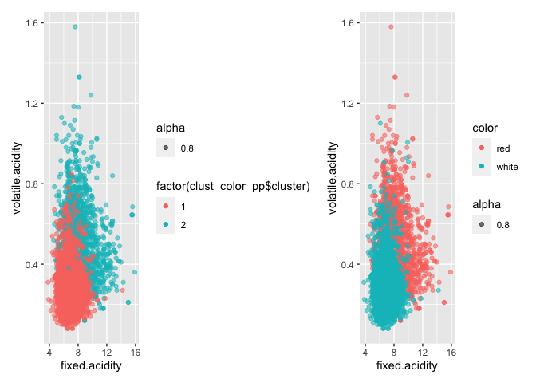
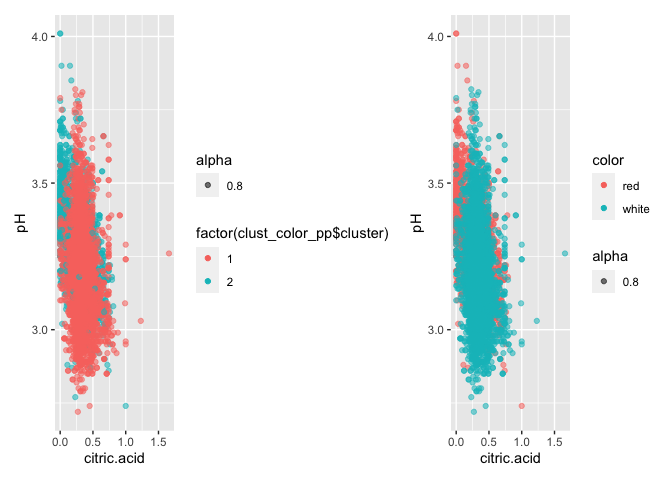
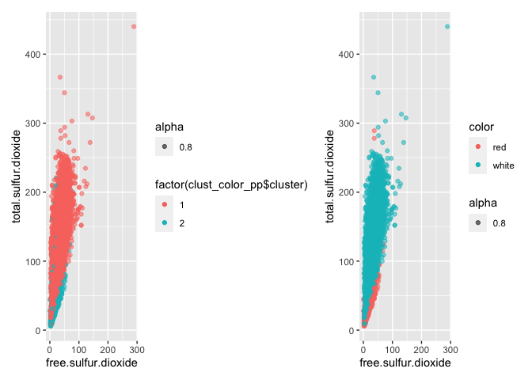
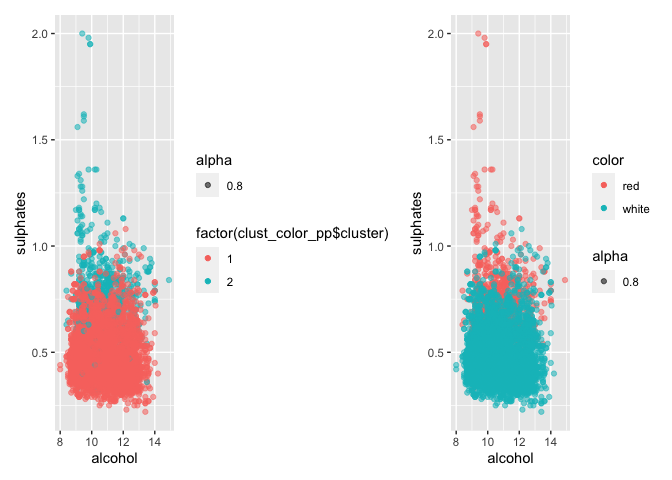
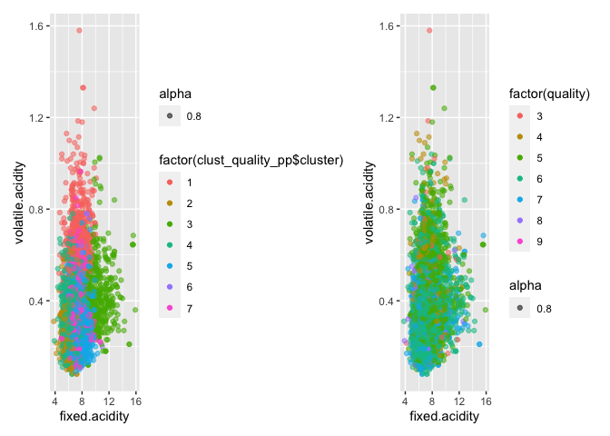
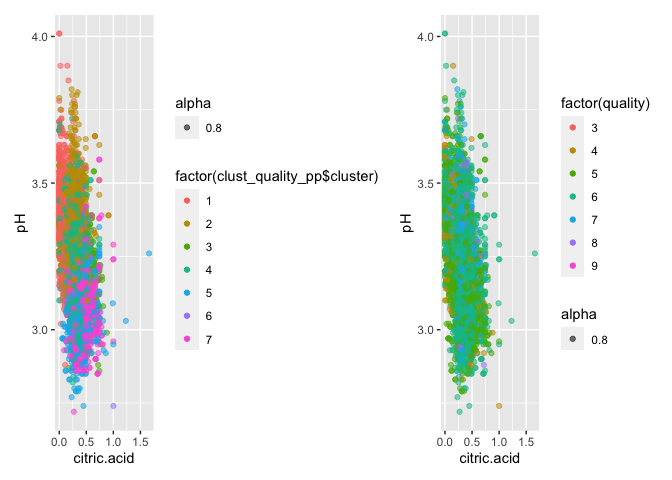
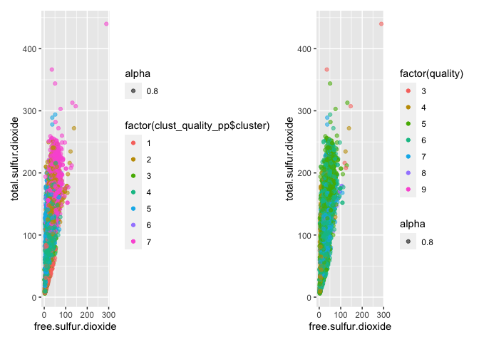
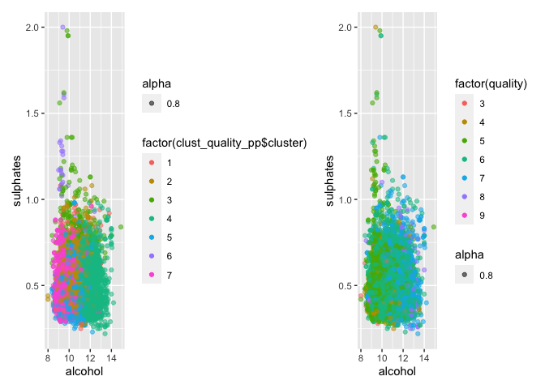
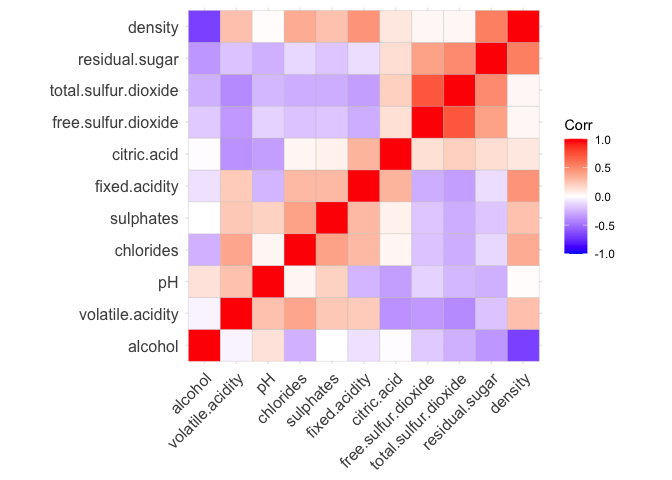
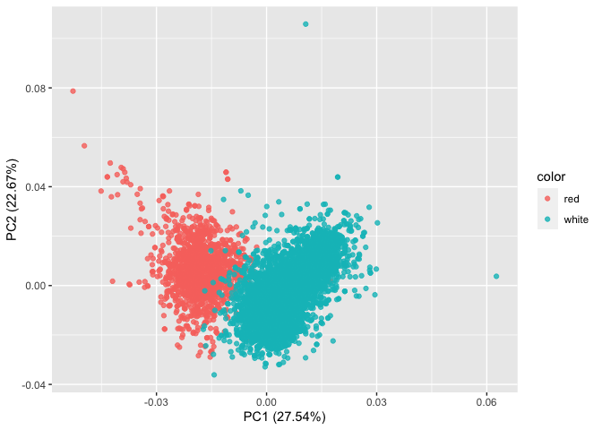

We first begin with a clustering algorithm which will partition the
various types of wine into their mutually exclusive groupings. Centering
and scaling the data allows for easier interpretability down the line.
This is also done to represent a solid measure of distance. For example,
the fixed acidity feature has a variation that is larger by a factor of
80 from that of the citric acid feature. If we do not center and scale
the data, distance would be biased towards and driven more by the former
feature as opposed to the latter. Thus standardizing gives the features
equal weight. The choice of K is intuitive. Since there are two
‘classes’ of wine, we will implement 2 clusters in the algorithm. The
other K we will choose is 7 as there are 7 different levels of quality.

    ##        fixed.acidity     volatile.acidity          citric.acid 
    ##           6.85167903           0.27458385           0.33524928 
    ##       residual.sugar            chlorides  free.sulfur.dioxide 
    ##           6.39402555           0.04510424          35.52152864 
    ## total.sulfur.dioxide              density                   pH 
    ##         138.45848785           0.99400486           3.18762464 
    ##            sulphates              alcohol 
    ##           0.48880511          10.52235888

    ##        fixed.acidity     volatile.acidity          citric.acid 
    ##            8.2895922            0.5319416            0.2695435 
    ##       residual.sugar            chlorides  free.sulfur.dioxide 
    ##            2.6342666            0.0883238           15.7647596 
    ## total.sulfur.dioxide              density                   pH 
    ##           48.6396835            0.9967404            3.3097200 
    ##            sulphates              alcohol 
    ##            0.6567194           10.4015216

    ##        fixed.acidity     volatile.acidity          citric.acid 
    ##           6.41706949           0.25182779           0.29706949 
    ##       residual.sugar            chlorides  free.sulfur.dioxide 
    ##           4.05624371           0.04580262          38.01913394 
    ## total.sulfur.dioxide              density                   pH 
    ##         146.91087613           0.99370579           3.34949648 
    ##            sulphates              alcohol 
    ##           0.54455186          10.35718026

    ##        fixed.acidity     volatile.acidity          citric.acid 
    ##           6.53149541           0.29512114           0.31520468 
    ##       residual.sugar            chlorides  free.sulfur.dioxide 
    ##           3.17911445           0.03556892          28.54636591 
    ## total.sulfur.dioxide              density                   pH 
    ##         106.90559733           0.99065575           3.21044277 
    ##            sulphates              alcohol 
    ##           0.48524645          12.19253690

    ##        fixed.acidity     volatile.acidity          citric.acid 
    ##           6.99176871           0.28134354           0.36414286 
    ##       residual.sugar            chlorides  free.sulfur.dioxide 
    ##          12.39142857           0.05078163          47.28061224 
    ## total.sulfur.dioxide              density                   pH 
    ##         172.37380952           0.99745107           3.13799320 
    ##            sulphates              alcohol 
    ##           0.49002721           9.44233560

<table class="table" style="margin-left: auto; margin-right: auto;">
<caption>
Z-Score of Features for Color Cluster
</caption>
<thead>
<tr>
<th style="text-align:right;">
Fixed Acidity
</th>
<th style="text-align:right;">
Volatile Acidity
</th>
<th style="text-align:right;">
Citric Acid
</th>
<th style="text-align:right;">
Residual Sugar
</th>
<th style="text-align:right;">
Chlorides
</th>
<th style="text-align:right;">
Free Sulfur Dioxide
</th>
<th style="text-align:right;">
Total Sulfur Dioxide
</th>
<th style="text-align:right;">
Density
</th>
<th style="text-align:right;">
pH
</th>
<th style="text-align:right;">
Sulphates
</th>
<th style="text-align:right;">
Alcohol
</th>
</tr>
</thead>
<tbody>
<tr>
<td style="text-align:right;">
-0.2804833
</td>
<td style="text-align:right;">
-0.3953082
</td>
<td style="text-align:right;">
0.1143429
</td>
<td style="text-align:right;">
0.1998380
</td>
<td style="text-align:right;">
-0.3119753
</td>
<td style="text-align:right;">
0.2814861
</td>
<td style="text-align:right;">
0.4018607
</td>
<td style="text-align:right;">
-0.2306934
</td>
<td style="text-align:right;">
-0.1920315
</td>
<td style="text-align:right;">
-0.2853595
</td>
<td style="text-align:right;">
0.0256206
</td>
</tr>
<tr>
<td style="text-align:right;">
0.8286464
</td>
<td style="text-align:right;">
1.1678795
</td>
<td style="text-align:right;">
-0.3378091
</td>
<td style="text-align:right;">
-0.5903919
</td>
<td style="text-align:right;">
0.9216848
</td>
<td style="text-align:right;">
-0.8316090
</td>
<td style="text-align:right;">
-1.1872380
</td>
<td style="text-align:right;">
0.6815493
</td>
<td style="text-align:right;">
0.5673286
</td>
<td style="text-align:right;">
0.8430523
</td>
<td style="text-align:right;">
-0.0756924
</td>
</tr>
</tbody>
</table>
<table class="table" style="margin-left: auto; margin-right: auto;">
<caption>
Z-Score of Features for Quality Cluster
</caption>
<thead>
<tr>
<th style="text-align:right;">
Fixed Acidity
</th>
<th style="text-align:right;">
Volatile Acidity
</th>
<th style="text-align:right;">
Citric Acid
</th>
<th style="text-align:right;">
Residual Sugar
</th>
<th style="text-align:right;">
Chlorides
</th>
<th style="text-align:right;">
Free Sulfur Dioxide
</th>
<th style="text-align:right;">
Total Sulfur Dioxide
</th>
<th style="text-align:right;">
Density
</th>
<th style="text-align:right;">
pH
</th>
<th style="text-align:right;">
Sulphates
</th>
<th style="text-align:right;">
Alcohol
</th>
</tr>
</thead>
<tbody>
<tr>
<td style="text-align:right;">
-0.5274559
</td>
<td style="text-align:right;">
-0.2705650
</td>
<td style="text-align:right;">
-0.0235934
</td>
<td style="text-align:right;">
-0.4758752
</td>
<td style="text-align:right;">
-0.5841517
</td>
<td style="text-align:right;">
-0.1114941
</td>
<td style="text-align:right;">
-0.1563816
</td>
<td style="text-align:right;">
-1.3475581
</td>
<td style="text-align:right;">
-0.0501164
</td>
<td style="text-align:right;">
-0.3092743
</td>
<td style="text-align:right;">
1.4259406
</td>
</tr>
<tr>
<td style="text-align:right;">
-0.1724256
</td>
<td style="text-align:right;">
-0.3542499
</td>
<td style="text-align:right;">
0.3131731
</td>
<td style="text-align:right;">
1.4603783
</td>
<td style="text-align:right;">
-0.1499198
</td>
<td style="text-align:right;">
0.9439921
</td>
<td style="text-align:right;">
1.0018998
</td>
<td style="text-align:right;">
0.9185510
</td>
<td style="text-align:right;">
-0.5007093
</td>
<td style="text-align:right;">
-0.2771468
</td>
<td style="text-align:right;">
-0.8798985
</td>
</tr>
<tr>
<td style="text-align:right;">
0.0771945
</td>
<td style="text-align:right;">
1.6981704
</td>
<td style="text-align:right;">
-1.2835162
</td>
<td style="text-align:right;">
-0.6297275
</td>
<td style="text-align:right;">
0.6832362
</td>
<td style="text-align:right;">
-0.8002076
</td>
<td style="text-align:right;">
-1.1694085
</td>
<td style="text-align:right;">
0.4928536
</td>
<td style="text-align:right;">
0.9656231
</td>
<td style="text-align:right;">
0.3895175
</td>
<td style="text-align:right;">
-0.2497441
</td>
</tr>
<tr>
<td style="text-align:right;">
0.0931313
</td>
<td style="text-align:right;">
-0.4425734
</td>
<td style="text-align:right;">
0.2378545
</td>
<td style="text-align:right;">
-0.2627581
</td>
<td style="text-align:right;">
-0.2075565
</td>
<td style="text-align:right;">
-0.2703133
</td>
<td style="text-align:right;">
0.0797292
</td>
<td style="text-align:right;">
-0.4182059
</td>
<td style="text-align:right;">
-0.7231890
</td>
<td style="text-align:right;">
-0.5057277
</td>
<td style="text-align:right;">
-0.0919311
</td>
</tr>
<tr>
<td style="text-align:right;">
-0.6157180
</td>
<td style="text-align:right;">
-0.5335282
</td>
<td style="text-align:right;">
-0.1483901
</td>
<td style="text-align:right;">
-0.2915193
</td>
<td style="text-align:right;">
-0.2920409
</td>
<td style="text-align:right;">
0.4222010
</td>
<td style="text-align:right;">
0.5514027
</td>
<td style="text-align:right;">
-0.3304273
</td>
<td style="text-align:right;">
0.8147143
</td>
<td style="text-align:right;">
0.0892679
</td>
<td style="text-align:right;">
-0.1128693
</td>
</tr>
<tr>
<td style="text-align:right;">
2.0108356
</td>
<td style="text-align:right;">
0.4602869
</td>
<td style="text-align:right;">
0.9140114
</td>
<td style="text-align:right;">
-0.5632053
</td>
<td style="text-align:right;">
0.8372629
</td>
<td style="text-align:right;">
-0.8913594
</td>
<td style="text-align:right;">
-1.2734222
</td>
<td style="text-align:right;">
0.9680135
</td>
<td style="text-align:right;">
-0.0004092
</td>
<td style="text-align:right;">
1.3005945
</td>
<td style="text-align:right;">
0.1115354
</td>
</tr>
<tr>
<td style="text-align:right;">
0.7455152
</td>
<td style="text-align:right;">
1.0520924
</td>
<td style="text-align:right;">
1.2188753
</td>
<td style="text-align:right;">
-0.4670271
</td>
<td style="text-align:right;">
8.7931881
</td>
<td style="text-align:right;">
-0.6868957
</td>
<td style="text-align:right;">
-0.6924492
</td>
<td style="text-align:right;">
0.7568104
</td>
<td style="text-align:right;">
-0.8406609
</td>
<td style="text-align:right;">
3.4798534
</td>
<td style="text-align:right;">
-0.7832782
</td>
</tr>
</tbody>
</table>

    ## [1] 56135.28

    ## [1] 34018.28

    ## [1] 15320.72

    ## [1] 37437.72

As we can see above, these are the center points (or centroids) for both
cluster types across all 11 features used, z-scored. Thus, the
interpretation of theses numbers are as a z-score. That is, how many
standard deviations above the mean of the entire data set a cluster is
for a given feature. For example, the residual sugar amount for the
cluster by wine color is .1998 standard deviations above the mean of all
data points. Extending the interpretation, we can see that cluster one
has below average fixed acidity, volatile acidity, chlorides, density,
pH, and sulphates. Similar interpretations can be made for the quality
cluster (i.e. - the quality score by the wine snobs) and above average
features. When clustering for wine color, the within sum of squares and
between sum of squares are the same. However, when clustering for
quality, the K-Means++ algorithm returns a higher within sum of squares
and lower between sum of squares. Thus, we will use K-Means++ for both
the wine color and quality plots to determine the actual vs. predicted
groupings.We will visualize the various relationships of various
features and how well K-Means++ has clustered the labels.

Above, we observe various feature relationships in two dimensions.
Unfortunately, observing all 11 features in 11 dimensions would be quite
ambiguous and tedious. We see here that the interpretation of K-Means++
clustering relative to the actual wine color groupings are rather on
par. The nice component of this analysis is the interpretability. There
seems to be a relatively clear distinction between red and white wines,
and the features represented here strongly indicate association

Observing the same relationships but for wine quality, we see the
interpretations are substantially more ambiguous and perhaps even
difficult to distinguish. Thus, wine quality is ambiguous. This makes
sense relative to how easily K-Means++ clustering grouped reds and
whites. A logical insinuation could be that color has a strong
association with the chemical process grapes undergo to evidently make
wine. Quality, however, was measured by wine tasting - a subjective
feature. Judges rating the quality of the wine certainly have personal
preferences. Thus, when attempting to cluster by quality level and
observing the various feature relationships, it is difficult to
distinguish what relationships among the features imply something about
the quality.

Next, we move onto a Principle Component Analysis (PCA) to determine if
this methodology allows for an easier interpretation of labels, and if
this emerges naturally from applying this technique.

When observing correlations of features, we re-order the features
according to hierarchical clustering. In the top left and bottom right
regions of the hierarchical correlation plot, we can observe strong,
negative correlations. Unless you are a wine maker, a chemist, or a wine
connoisseur, perhaps these correlations do not make a lot of sense.
Let’s take an example of the negative correlation between alcohol level
and sulfur dioxide. A relatively straightforward example from this plot
could be the negative correlation between density and alcohol. Ethanol
is less dense than water, and the higher the concentration, the lower
the density. This is because the molecules of ethanol are not as densely
packed as, say, water. Chemical relationships are vast, so it is
important to disclaim that correlation may not imply causation in this
case. For this reason, it actually may not be best practice to
consolidate these chemical components of wine just because they appear
to be similar.

    ## Importance of first k=3 (out of 11) components:
    ##                           PC1    PC2    PC3
    ## Standard deviation     1.7407 1.5792 1.2475
    ## Proportion of Variance 0.2754 0.2267 0.1415
    ## Cumulative Proportion  0.2754 0.5021 0.6436

There are several takeaways from observing the summary of the analysis.
We see the standard deviation of the PCs is highest in PC1. The
proportion of variance each PC accounts for from the original data is
somewhat the same, but this proportion is highest in PC1.Cumulatively,
all three principle components account for a little more than two-thirds
of the variation from the original data.

<table>
<caption>
Principle Components
</caption>
<thead>
<tr>
<th style="text-align:left;">
</th>
<th style="text-align:right;">
PC1
</th>
<th style="text-align:right;">
PC2
</th>
<th style="text-align:right;">
PC3
</th>
</tr>
</thead>
<tbody>
<tr>
<td style="text-align:left;">
fixed.acidity
</td>
<td style="text-align:right;">
-0.24
</td>
<td style="text-align:right;">
0.34
</td>
<td style="text-align:right;">
-0.43
</td>
</tr>
<tr>
<td style="text-align:left;">
volatile.acidity
</td>
<td style="text-align:right;">
-0.38
</td>
<td style="text-align:right;">
0.12
</td>
<td style="text-align:right;">
0.31
</td>
</tr>
<tr>
<td style="text-align:left;">
citric.acid
</td>
<td style="text-align:right;">
0.15
</td>
<td style="text-align:right;">
0.18
</td>
<td style="text-align:right;">
-0.59
</td>
</tr>
<tr>
<td style="text-align:left;">
residual.sugar
</td>
<td style="text-align:right;">
0.35
</td>
<td style="text-align:right;">
0.33
</td>
<td style="text-align:right;">
0.16
</td>
</tr>
<tr>
<td style="text-align:left;">
chlorides
</td>
<td style="text-align:right;">
-0.29
</td>
<td style="text-align:right;">
0.32
</td>
<td style="text-align:right;">
0.02
</td>
</tr>
<tr>
<td style="text-align:left;">
free.sulfur.dioxide
</td>
<td style="text-align:right;">
0.43
</td>
<td style="text-align:right;">
0.07
</td>
<td style="text-align:right;">
0.13
</td>
</tr>
<tr>
<td style="text-align:left;">
total.sulfur.dioxide
</td>
<td style="text-align:right;">
0.49
</td>
<td style="text-align:right;">
0.09
</td>
<td style="text-align:right;">
0.11
</td>
</tr>
<tr>
<td style="text-align:left;">
density
</td>
<td style="text-align:right;">
-0.04
</td>
<td style="text-align:right;">
0.58
</td>
<td style="text-align:right;">
0.18
</td>
</tr>
<tr>
<td style="text-align:left;">
pH
</td>
<td style="text-align:right;">
-0.22
</td>
<td style="text-align:right;">
-0.16
</td>
<td style="text-align:right;">
0.46
</td>
</tr>
<tr>
<td style="text-align:left;">
sulphates
</td>
<td style="text-align:right;">
-0.29
</td>
<td style="text-align:right;">
0.19
</td>
<td style="text-align:right;">
-0.07
</td>
</tr>
<tr>
<td style="text-align:left;">
alcohol
</td>
<td style="text-align:right;">
-0.11
</td>
<td style="text-align:right;">
-0.47
</td>
<td style="text-align:right;">
-0.26
</td>
</tr>
</tbody>
</table>

Looking at the table, we notice similar loadings in PC1 as the
correlation plot. The higher, positive magnitudes associated with each
feature represents stronger positive correlations and higher, negative
magnitudes associated with each feature represents stronger, negative
correlations. PC2 may be a bit more ambiguous, in that all features but
pH and alcohol are positive. PC3 is similar but still different from
PC1.

As the clustering methods showed, the color of the wine is easily
separated by principle components and they are easily distinguished. We
can also make the same conclusion about the quality level of wine
(i.e. - it is ambiguous). By consolidating the features for each data
point, the principle component does a great job at associating the
linear summaries for color of wine.

Both clustering and principle components analysis come to the same
conclusions more or less. However, K-Means++ offers slightly easier
interpretability since we are able to observe relationships while
holding clusters constant. The major difference between the clustering
methods and the PCA analyses are that the former consolidates by rows
(observations) depending on how you choose the number of clusters (k)
while the latter consolidates the columns (features). In doing so, there
are multiple things to say. Clustering is mutually exclusive meaning
each point is a member of only one cluster. A PCA, however, assumes that
a data point is some combination of many features which is linearly
summarized by projecting each data point and attempting to preserve
variation of the data. As alluded to before hand, this may simplify
something that may better be interpreted in its original form. Thus,
both methodologies yield similar conclusions. However,in this instance,
K-Means++ allows for a richer interpretation of the data in a multitude
of ways.
